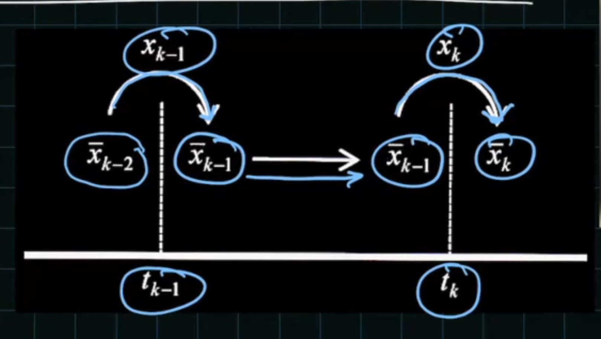
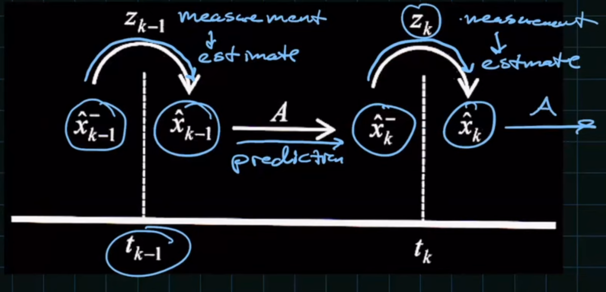
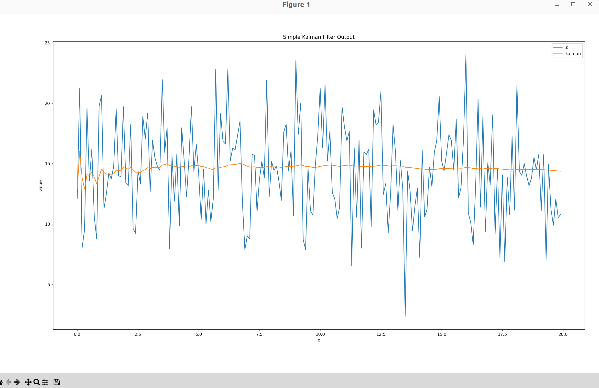

# Simple Kalman Filter

A basic implementation of a **1D Kalman Filter** in modern C++ that processes a noisy scalar signal and estimates its true value over time.

---

## Features

- Implements a first-order recursive **Kalman Filter**
- Adapted from a [Matlab script](https://drive.google.com/drive/folders/1oWAfdf_yQxBGWD2QgRBZjDGRykVwizBg)
- Unit tests with GoogleTest
- Generates CSVs for filtered data that can be visualized via Python scripts

---

## Algorithm Summary

The Kalman filter equations implemented are:

```
Prediction:
  x⁺ = A * x
  P⁺ = A * P * A + Q

Kalman Gain:
  K = P⁺ * H / (H * P⁺ * H + R)

Update:
  x = x⁺ + K * (z - H * x⁺)
  P = P⁺ - K * H * P⁺
```

Where:

- `x` = estimated state
- `P` = estimate covariance
- `A`, `H`, `Q`, `R` = model parameters
- `z` = observed measurement

---

## Comparision to Low pass filter
Captured these images from youtube video. [Watch Kalman vs LPF explanation (starts at 18:06)](https://www.youtube.com/watch?v=qCZ2UTgLM_g&t=1086s)  
(*Watch from 18:06 to 21:45 for the relevant segment*)





## Output Files

Two types of tests write CSV files to `utils/data/`:

### 1. Sanity Test

File: `kalman_sanity.csv`

- Simulates a noisy constant signal (`z`) and applies the Kalman filter.
- Helps verify filter convergence over time.

### 2. Real Dataset Simulation

File: `kalman_sonar.csv`

- Applies Kalman filter to `SonarAlt.csv` measurements (original dataset).

---

## Visualization

Use the provided Python script:

```bash
python3 utils/scripts/plot.py utils/data/kalman_sanity.csv -x step -y z filtered --title "Kalman Filter"
```





---

## Notes

- You can adjust the **measurement noise variance** (`R`) via the `KALMAN_R` environment variable:

  ```bash
  KALMAN_R=2.0 ctest -R Kalman
  ```

- Default starting state is `x=14` with covariance `P=6`, and model assumes no process noise (`Q=0`).

---

