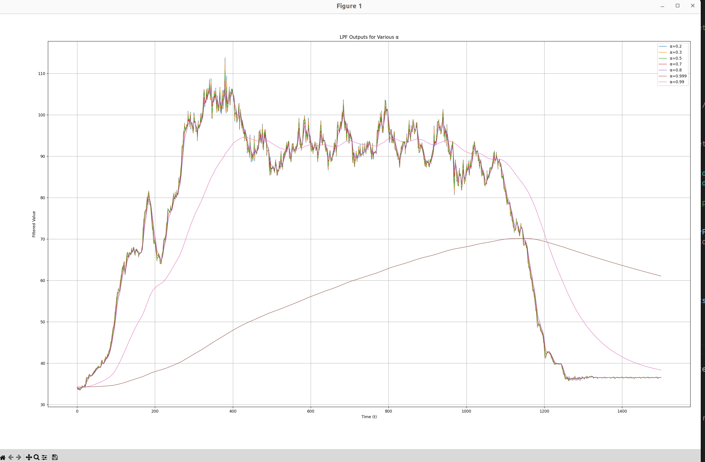

# First-Order Low-Pass Filter (LPF)

This module implements a **first-order low-pass filter** using the recursive formula:

$$
y_k = \alpha \cdot y_{k-1} + (1 - \alpha) \cdot x_k
$$

Where:
- $x_k$ is the current input
- $y_{k-1}$ is the previous output
- $\alpha$ is the smoothing factor: 0 ≤ α ≤ 1  
  - Lower α → more responsive to changes (less smoothing)  
  - Higher α → smoother output (less responsive)

---

## API

Header: `lpf/LowPassFilter.hpp`

```cpp
namespace Filters { 
namespace LPF {

class LowPassFilter
{
public:
    LowPassFilter();

    // Feed one sample with current alpha; returns filtered output
    double update(double x);

    // Reset internal state (y = x on first call)
    void reset();

    // Access current filtered value
    double getOutput() const;
};

}
} 
```

---

## Directory Layout

```
lpf/
├── CMakeLists.txt
├── LowPassFilter.cpp
├── LowPassFilter.hpp
├── README.md
└── test/
    ├── CMakeLists.txt
    └── LowPassFilterTests.cpp
```

---

## Test & Visualization

The LPF test loads `SonarAlt.csv`, runs the filter, and writes an output CSV for plotting.  
You can vary `alpha` like this:

```bash
LPF_ALPHA=0.5 ctest --test-dir build -R FilterLpfTests
```

### Comparison Screenshot

Below is a comparison of filtered outputs using different α values:



